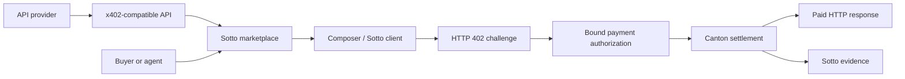

# Sotto

Sotto is the Canton-focused marketplace, execution surface, and evidence layer
for x402-paid APIs.

Developers publish APIs that already return a valid Canton x402 payment
challenge. Buyers and agents discover those resources, execute paid calls, and
inspect settlement and delivery as separate facts. Sotto's Canton-specific goal
is private, bounded agent-purchase authority. The Five North DevNet spike proved
that research boundary; production remains gated by the implementation and
release evidence below.

## Current Status

This repository has fresh history and is implementing the production foundation
after the completed Five North spike. It does not yet contain a shipping
marketplace, facilitator, wallet, MCP server, CLI, or production deployment.

The research spike has now produced:

1. a real Five North `402 -> settle -> 200` purchase in which an external agent
   alone exercised a payer-signed bounded capability;
2. one accepted update that paid the provider 0.25 Canton Coin, returned 0.75 to
   the payer, and created a revision-1 capability with 0.075 remaining;
3. a byte-identical cached `200` retry with no second Ledger submission;
4. a prepare-only direct-transfer control in which the agent was rejected for
   missing payer authority, the payer control prepared, and execution remained
   disabled; and
5. party-scoped private-context visibility for payer, agent, and provider, with
   an outsider seeing no context and receiving `404`, while the accepted
   settlement is independently visible through the public Lighthouse explorer;
   and
6. a real policy-free Five North human prepare-only path whose complete Token
   effects and participant-provided hash passed independent verification, with
   no wallet approval, signature, execution, settlement, or Canton Coin debit;
   and
7. a real policy-free human-wallet purchase in which an isolated reference
   wallet approved the exact request and debit bounds, signed outside the Sotto
   process, settled on Five North, reconciled from the provider view, and
   unlocked the authentic JSON `200`.

The spike's signer/funding-authority and public-settlement-visibility blockers
are closed. The production gate is still `NO_GO`: production wallet and
prepare-authority key custody, connector deployment, deployed worker execution,
durable delivery and unknown-outcome recovery, and release evidence for the
approved production topology remain open. Receipt audience Q-004 and topology
Q-006 are selected but not yet proven in production. The
[redacted spike result](docs/architecture/devnet-spike-result.md) records the
evidence and remaining blockers.

The production foundation now applies bounded, advisory-locked migrations from
its compiled artifact and durably records provider/origin registration, origin
proof, immutable resource revisions, publication, and latest resource health.
Its server-side catalog probe is currently `GET`-only: it loads the trusted
origin from PostgreSQL, rejects non-public DNS answers, pins the selected
address through HTTPS/TLS, parses a bounded server-observed Canton x402
challenge, and atomically records the probe plus health result. Disposable
digest-pinned PostgreSQL tests prove migration replay, conflict rollback, and
restart persistence. The same private database can now atomically initialize an
authenticated human-wallet purchase attempt, its first append-only event, a
short-lived encrypted prepare-authority envelope, and one prepare-only outbox
job. Real PostgreSQL and ephemeral-key tests prove exact replay, concurrency,
tamper and corruption rejection, signing-reserve rollback, migration failure for
legacy ready jobs, generation-bound worker leasing, and lease-gated restart
reauthentication. The one-shot prepare worker now claims one PostgreSQL job,
runs the real holding, TransferFactory, participant-prepare, full-effect, and
official-hash pipeline outside database transactions, and atomically records the
verified checkpoint before returning process-local wallet material. Real
PostgreSQL tests also prove that blocked external work does not block unrelated
database work. Production key storage, rotation, backup, recovery, and deployed
worker evidence remain release gates. It cannot yet approve, sign, execute,
settle, or deliver that purchase. This is a library/integration checkpoint, not
a deployed marketplace: web, the deployed worker process, restart-safe wallet
handoff, later purchase lifecycle, delivery recovery, production wallet
connectors, external HTTPS smoke evidence, and deployment remain open.

No mocked payment or fixture transaction can satisfy those gates.

## Product Shape



Planned product surfaces are the marketplace, provider/resource detail, Add API,
Composer, Sotto Scan, transaction evidence, statistics/health, owner session,
thin CLI, buyer MCP, skill, and internal listing moderation.

## Hard Boundaries

- Canton is the only first-release rail.
- Sotto reuses existing Canton x402 infrastructure and does not claim to have
  invented the facilitator or protocol.
- Pasting an API URL does not make it payable.
- Payment settlement and API delivery remain separate statuses.
- Public Scan covers only reliably Sotto-attributed activity.
- Canton Coin transfer facts may be public. Prompts, results, mandate state, and
  private purchase context do not become public automatically.
- Email OTP, organizations, teams, auditors, payroll, banking, withdrawals,
  multi-network rankings, and public sample tenants are outside this product.

## Repository Authority

- [Product contract](docs/product/product-contract.md)
- [Decision summary](docs/product/decision-summary.md)
- [DevNet spike plan](docs/architecture/devnet-spike-plan.md)
- [Quality contract](docs/quality/quality-contract.md)
- [Agent router](AGENTS.md)

The prior payroll product is preserved at commit `c29e4da` in the archived
[Sotto payroll repository](https://github.com/Blockchain-Oracle/sotto-payroll-archive).
Its code and deployed DAR are not evidence for this product.

## Development

The spike workspace pins Node 24.18.0, pnpm 11.12.0, Java 21.0.11, DPM 1.0.21,
and Daml SDK 3.5.2. Run every deterministic local gate from the repository root:

```bash
pnpm install --frozen-lockfile
pnpm verify
```

Live Five North payment evidence is a separate manual gate and requires the
credentials named, without values, in `.env.example`.
