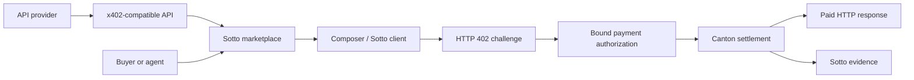

# Sotto

Sotto is the Canton-focused marketplace, execution surface, and evidence layer
for x402-paid APIs.

Developers publish APIs that already return a valid Canton x402 payment
challenge. Buyers and agents discover those resources, execute paid calls, and
inspect settlement and delivery as separate facts. Sotto's Canton-specific goal
is private, bounded agent-purchase authority, but that claim remains gated by a
real Five North DevNet authority spike.

## Current Status

This repository has fresh history and is currently the spike workspace. It does
not yet contain a shipping marketplace, facilitator, wallet, MCP server, CLI, or
production deployment.

The research spike has now produced:

1. a real Canton DevNet `402 -> payment -> 200` request;
2. an uploaded and exercised Sotto research Daml package;
3. one accepted update combining policy consumption, private context, and Canton
   Coin transfer, plus a rejected rollback probe;
4. party-scoped Daml stakeholder visibility and a post-success provider-outage
   reconciliation check.

The production gate is `NO_GO`. The available machine credential can bypass the
policy with a generic transfer, the Loop human-payment path is on a different
participant topology, and public explorer visibility is not proven. The
[redacted spike result](docs/architecture/devnet-spike-result.md) records the
evidence and remaining blockers.

No mocked payment or fixture transaction can satisfy those gates.

## Product Shape



Planned product surfaces are the marketplace, provider/resource detail, Add API,
Composer, Sotto Scan, transaction evidence, statistics/health, owner session,
thin CLI, buyer MCP, skill, and internal listing moderation.

## Hard Boundaries

- Canton is the only first-release rail.
- Sotto reuses existing Canton x402 infrastructure and does not claim to have
  invented the facilitator or protocol.
- Pasting an API URL does not make it payable.
- Payment settlement and API delivery remain separate statuses.
- Public Scan covers only reliably Sotto-attributed activity.
- Canton Coin transfer facts may be public. Prompts, results, mandate state, and
  private purchase context do not become public automatically.
- Email OTP, organizations, teams, auditors, payroll, banking, withdrawals,
  multi-network rankings, and public sample tenants are outside this product.

## Repository Authority

- [Product contract](docs/product/product-contract.md)
- [Decision summary](docs/product/decision-summary.md)
- [DevNet spike plan](docs/architecture/devnet-spike-plan.md)
- [Quality contract](docs/quality/quality-contract.md)
- [Agent router](AGENTS.md)

The prior payroll product is preserved at commit `c29e4da` in the archived
[Sotto payroll repository](https://github.com/Blockchain-Oracle/sotto-payroll-archive).
Its code and deployed DAR are not evidence for this product.

## Development

The spike workspace pins Node 24.18.0, pnpm 11.12.0, Java 21.0.11, DPM 1.0.21,
and Daml SDK 3.5.2. Run every deterministic local gate from the repository root:

```bash
pnpm install --frozen-lockfile
pnpm verify
```

Live Five North payment evidence is a separate manual gate and requires the
credentials named, without values, in `.env.example`.
