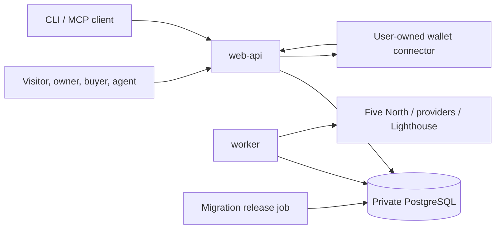

# Production Foundation Design

Date: 2026-07-17

Status: approved for implementation

## Objective

Replace the spike's process-local durability and workstation wallet handoff with
the smallest production foundation that can safely support Sotto's marketplace,
provider publishing, human purchases, autonomous purchases, and evidence views.

This decision closes product questions Q-004 and Q-006. It does not issue a
production `GO`. The implementation, restart, connector, deployment, and final
verification evidence below must pass first.

## Accepted Inputs

- The Five North spike proves one external-agent bounded purchase and one
  wallet-neutral human purchase through authentic paid delivery.
- Settlement and delivery are separate outcomes.
- Browser-provided payment fields are never authoritative.
- PostgreSQL is the durable application authority. Redis is optional
  acceleration only and is absent from the first-release authority path.
- Browsing, provider publishing, and one-time human purchases do not require an
  autonomous spending policy.
- Sotto never receives or stores a raw payer key.

## Decisions

### Q-004: Private Receipt Audience

The first release uses a least-privilege split:

- The authenticated owner and paying party may read the enriched private
  receipt.
- The initiating agent may read it only for the purchase it initiated.
- The provider receives the minimum settlement and delivery reference required
  to reconcile and serve the paid request. It does not receive buyer prompts,
  private response content, purpose, or mandate state.
- Operators receive redacted operational evidence, not generic payer or agent
  read authority.
- Public views expose only privacy-safe settlement facts, lifecycle status,
  hashes, and an explorer link when indexed.
- Unauthorized private-receipt lookup returns not-found and does not reveal
  whether a receipt exists.

The provider-visible Daml `PurchaseContext` is a settlement reference, not the
enriched application receipt.

### Q-006: Process And Data Topology

The first release uses one repository and one non-root application image with
separate commands:

1. `web-api` serves the marketplace, owner sessions, Add API, Composer,
   transaction status, HTTP API, and remote MCP ingress.
2. `worker` runs probes, Ledger reconciliation, paid delivery and recovery,
   public-explorer indexing checks, and PostgreSQL outbox jobs.
3. A private PostgreSQL service is the sole durable application authority.
4. Wallet connectors and signers remain outside the application/database trust
   boundary and expose only identity discovery plus exact approval/signature.
5. An explicit release job applies migrations before web and worker rollout.

Probe and purchase work initially share the worker with separate job kinds and
concurrency limits. Redis and a separate queue service are not introduced until
deployed measurements prove a need.

## Wallet Custody And Connectors

The wallet-neutral transaction core remains unchanged. The first supported
production connector is a user-owned Wallet SDK companion:

- distributed as a signed, reproducible artifact outside `spikes/`;
- stores its key in an OS keystore, Secure Enclave, hardware device, or another
  non-exportable user-controlled facility;
- uses authenticated, origin-bound, replay-safe local communication;
- displays the already verified request, recipient, amount, fee/debit ceiling,
  network, synchronizer, package, and expiry;
- signs only after explicit approval and returns only the bounded signature
  response; and
- supports cancellation, expiry, rotation, revocation, loss, and incident
  procedures without a Sotto-held recovery key.

An injected OpenRPC connector is the second adapter. Loop is enabled only after
capability negotiation and a same-topology live Five North proof. There is no
fallback to the shared credential, a generic signing endpoint, or a
Sotto-managed payer key.

## Durable Data Model

### Catalog And Publishing

- `owners`, `owner_sessions`
- `providers`, `origins`, `origin_proofs`
- `catalog_registrations` supplies replay-safe atomic provider/origin setup
  identities; it derives owner and provider through the origin relationship.
- `resources`, immutable `resource_revisions`
- `probe_observations`, `health_observations`
- `listings`

Publication points to a verified immutable resource revision. Server-observed
challenge data is authoritative; browser-submitted price, recipient, network,
scheme, or compatibility is not.

### Purchase And Delivery

- `purchase_attempts` owns deterministic operation, attempt, request, and
  purchase identities.
- `attempt_events` is the append-only ordered lifecycle record.
- `settlements` records submission, completion, rejection, and reconciliation
  independently from delivery.
- `delivery_claims` owns the unique
  `(update_id, attempt_id, request_commitment)` dispatch boundary.
- `delivery_responses` stores the bounded exact response required for
  byte-identical replay or an encrypted private blob reference.
- `private_attempt_payloads` stores only the encrypted, bounded request material
  needed for identical delivery. It excludes authorization headers, keys, raw
  signatures, and prepared transactions.
- `private_prepare_authorities` is a separate short-lived encrypted authority
  envelope for restarting the prepare stage. It contains the original bounded
  purchase commitment bytes, canonical request-binding bytes, decoded 402
  challenge bytes, owner-bound connector locator, and trusted-configuration
  identity needed to reauthenticate the same purchase. It contains no wallet
  key, signature, prepared transaction, provider response, or delivery body.
- `outbox_jobs` supplies durable work, deduplication, leases, retries, and
  terminal results.
- `worker_heartbeats` distinguishes worker health from web and database health.

All public evidence is an allowlisted projection. Private payloads and exact
provider bodies never enter logs or public evidence.

### Restartable Prepare Authority

A prepare job is not restartable merely because its hashes and queue row are
durable. The human purchase commitment, wallet preflight, package observation,
holdings, registry context, and command authority use process-local provenance.
Re-fetching the provider or rebuilding the commitment after a crash creates a
new purchase identity.

The first-release restart boundary therefore seals a dedicated prepare-authority
envelope with authenticated encryption before the attempt, first event, and
prepare job commit. Its additional authenticated data binds the envelope schema,
attempt, operation, request hash, owner, resource revision, purchase commitment,
and recorded source commit. The encryption key remains outside PostgreSQL;
PostgreSQL stores only the key identifier, unique nonce, authentication tag, and
bounded ciphertext. A newer compatible worker uses the recorded source commit as
authenticated history, not as an equality check that would strand existing jobs
after deployment.

Restoration must:

1. open the envelope and verify its row-bound authenticated data;
2. strictly parse the three original bounded byte sequences and recompute the
   request, challenge, attempt, and purchase identities;
3. confirm the exact catalog revision, connector binding, trusted configuration,
   route, payer, provider, amount, instrument, network, synchronizer, limits,
   package closure, and signing-key identity;
4. reacquire the owner-bound wallet/payer and package authority, allowing only
   observation identifiers/times and acquisition times to refresh; and
5. issue a new process-local one-shot command authority while the durable
   attempt is still prepare-retryable and at least two signing minutes remain.

Holdings, disclosures, TransferFactory context, prepared responses, and official
hash verification are always reacquired. Opening the envelope is non-consuming;
the durable job lease and attempt transition own cross-process replay. Once
`prepared-hash-verified` commits, the prepare authority can no longer be
claimed. Wrong keys, changed rows or authenticated data, connector revocation,
stable key/topology/package/configuration drift, stale attempts, and structural
clones fail closed without a Ledger command.

The repository does not expose authority restoration before the lease boundary
exists. The internal restore path is deterministic and integration-tested, but
only a generation-bound live worker lease may make it reachable in production.
Migration from a database containing legacy ready prepare jobs fails closed
until those jobs are explicitly quarantined; they cannot be silently promoted
without their missing encrypted authority envelopes.

Production key storage, rotation, backup, and recovery remain release gates.
Real ephemeral-key cryptographic and PostgreSQL tests prove the code boundary;
they do not by themselves prove production custody.

## Transaction And Idempotency Boundary

- Attempt creation, its first event, and its first outbox job commit atomically.
- Deterministic command/submission identifiers and `execution-started` commit
  before Ledger execution.
- An uncertain Ledger result schedules reconciliation. It never triggers a new
  signature or resubmission until the accepted completion oracle proves the
  original command absent.
- Workers claim ready jobs with short PostgreSQL transactions and leases, then
  perform network I/O outside the transaction.
- State transition and the next outbox job commit together.
- Paid delivery claims use the exact composite identity before dispatch.
- A successful bounded response and `delivered` transition commit together.
- A lost provider response becomes durable `delivery-unknown`. It is not
  automatically retried unless the provider offers the same proven idempotency
  identity or Sotto controls a durable gateway/cache.

PostgreSQL cannot make an arbitrary external HTTP side effect exactly once. The
honest contract is at-least-once job processing, database-enforced idempotency,
Ledger reconciliation, exact successful replay, and fail-closed unknown
delivery.

## Failure And Recovery Contract

- Two workers cannot execute the same live lease concurrently.
- Restart at every lifecycle boundary preserves the exact attempt state.
- Restart never causes a second wallet approval, signature, or Ledger submission
  for an unresolved operation.
- A settled purchase survives web/worker replacement and returns the exact
  cached response or remains honestly `delivery-unknown`.
- Database backup and restore preserve catalog, attempts, events, settlements,
  delivery responses, and pending jobs.
- Web liveness, web readiness, database readiness, and worker heartbeat are
  separate signals.

## Performance Contract

The database path uses bounded queries, explicit indexes, connection-pool
limits, and short transactions. Network I/O never occurs while a row lock is
held. Queue lag, query plans, pool saturation, end-to-end latency, and response
storage are measured in the deployed environment before Redis or additional
services are considered.

## Implementation Sequence

1. Pin the PostgreSQL image, TypeScript driver, migration tooling, and real
   disposable-service test path from current official documentation.
2. Add the database package, repeatable migrations, catalog foundation, and real
   PostgreSQL integration gate.
3. Port the proven purchase lifecycle behind a storage interface to
   `purchase_attempts`, `attempt_events`, and `settlements`.
4. Add the PostgreSQL outbox, worker leases, crash/restart tests, delivery
   claims, and exact response replay.
5. Add `web-api`, `worker`, migration, health, and graceful-shutdown commands
   plus the Coolify resource topology.
6. Productionize the user-owned Wallet SDK companion, then add the capability-
   negotiated OpenRPC adapter.
7. Prove a real Five North purchase through process replacement and authentic
   paid delivery, then run the final verification audit.

Each step follows RED-GREEN-REFACTOR and lands as an independently reviewed
checkpoint. Unit fakes are allowed only at external ports. PostgreSQL behavior
must be tested against a disposable real PostgreSQL service; no in-memory or
SQLite substitute may satisfy the integration gate.

## Production GO Criteria

- Repeatable migrations pass against an empty and an upgraded database.
- Catalog and publication state survive restart and restore.
- Two concurrent workers produce one settlement/delivery path.
- Every lifecycle crash point recovers without a second signature or Ledger
  submission.
- Successful replay is byte-identical across process replacement.
- Unknown settlement is reconciled before any retry; unknown delivery remains
  explicit.
- Receipt authorization matches Q-004 and unauthorized lookup is existence-
  hiding.
- The production wallet connector stores no raw key in Sotto and completes the
  exact live Five North approval, settlement, reconciliation, and `200` path.
- PostgreSQL is private, backups restore successfully, and release rollback is
  proven.
- Web, worker, database, and wallet boundaries pass security, health, failure,
  and privacy review.
- The full deterministic gate, clean-clone gate, deployed smoke tests, and final
  independent verification audit pass.

Until every criterion passes, production remains `NO_GO` even though Q-004 and
Q-006 are now selected.

## Rejected Alternatives

- One combined web/worker process: fewer resources, but deployments and HTTP
  load interrupt reconciliation and delivery recovery.
- Early microservices plus Redis: adds split authority, eviction, queue, and
  failover complexity without closing a current acceptance gate.
- Sotto-managed HSM/KMS payer: smoother UX but custodial and retains generic
  payer authority. It is outside the approved first-release trust model.
