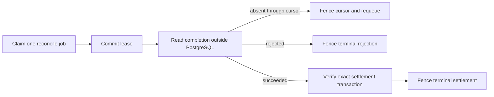

# PostgreSQL Reconciliation Worker Design

## Status

Approved under the owner's standing delegation and the explicit instruction to
continue the named next slice. This design does not issue a production `GO`.

## Objective

Recover an `execution-started` human-wallet purchase after a true worker process
loss without requesting another approval, resolving another key, signing again,
or sending another Ledger execute request.

The worker resolves settlement only. Paid HTTP delivery remains a separate
durable stage because settlement and delivery have different failure modes.

## Options Considered

1. Completion-only worker: smallest, but a successful command completion is not
   enough to prove the exact provider settlement.
2. Completion plus exact settlement verification: selected. A rejection is
   terminal; success is terminal only after the transaction matches the stored
   settlement expectation; absence is requeued.
3. Settlement and paid delivery together: rejected for this checkpoint because
   it combines Ledger and provider recovery and weakens the explicit state
   split.

## Trust Boundary

The worker receives only:

- a generation-bound PostgreSQL reconcile lease;
- the immutable authenticated settlement expectation;
- the durable command ID, execution user, submission ID, and completion cursor;
- a bounded read-only reconciliation transport; and
- cancellation.

It has no wallet connector, payer key, key resolver, signing session, prepared
transaction, raw signature, or execute transport. These dependencies are absent
from its public type, not merely unused by convention.

The read-only transport may return:

- `pending` with the fully scanned completion offset;
- `rejected` with the exact completion offset and canonical status code; or
- `succeeded` with the completion offset, update ID, and transaction response.

The worker core validates all result shapes. A `succeeded` result is persisted
only after the production settlement verifier authenticates the transaction
against the restored expectation. A malformed, mismatched, or transport-failed
result leaves the lease unresolved for expiry and reclaim.

The bounded adapter reads completion and provider transaction as one logical
probe. An absent completion may advance the durable cursor through the fully
scanned Ledger end. A successful completion whose provider transaction is not
yet visible must return pending without advancing past that completion, so the
next lease observes it again. This intentionally avoids a second job kind and
intermediate completion state for the hackathon checkpoint.

## Durable Model

Migration `0010` extends the existing journal rather than adding a second queue.

- Attempt terminal states: `settlement-reconciled` and `settlement-rejected`.
- Settlement states: `settlement-reconciled` and `settlement-rejected`.
- Event 6 is one of those two terminal events.
- Terminal settlement data records completion offset, update ID for success,
  status code for rejection, and reconciliation time with mutually exclusive
  constraints.
- `reconciliation_offset` begins at the attempt's `begin_exclusive` and advances
  monotonically after a complete absent scan.
- Completed-job coherence is kind-aware: a `purchase-reconcile` job points to
  event 6, while the existing `purchase-prepare` completion continues to point
  to event 2.
- Immutable expectation and attempt identity remain protected by the existing
  settlement authority trigger. Only operational state, cursor, and terminal
  result columns may change.

Two narrow partial indexes cover ready reconcile work and expired reconcile
leases using the literal predicates in the claim query.

## Processing Order

The claim and checkpoint are separate short transactions. Every checkpoint
requires the exact job ID, attempt ID, owner, generation, and unexpired lease. A
stale worker cannot move the cursor or publish a terminal outcome after lease
reclaim.

## Idempotency And Failure Rules

- Two workers racing for one job produce one lease winner.
- An expired lease increments generation; the old generation cannot commit.
- Pending reconciliation advances only to a non-decreasing fully scanned offset
  after an absent completion and requeues with a short database-time delay.
- Provider-transaction lag after a successful completion requeues at the prior
  cursor, preserving the completion for the next bounded probe.
- Terminal checkpoint appends one event, updates attempt and settlement, and
  completes the job atomically.
- Replaying an identical terminal checkpoint returns the existing result;
  changed update ID, offset, or rejection status conflicts.
- A crash before the checkpoint leaves a reclaimable lease.
- A crash after the checkpoint observes the terminal lifecycle and performs no
  external call.
- No outcome permits another wallet, signature, dispatch, or execute call.

## Performance Shape

- One ordered `SKIP LOCKED` claim query.
- One bounded external reconciliation pass.
- One short cursor or terminal checkpoint transaction.
- No database connection is held during network reads.
- No Redis, advisory lock, heartbeat daemon, batch scheduler, or generalized job
  framework is introduced in this slice.

The first implementation remains a one-shot `runOne` library. Polling and
concurrency configuration belong to the later worker-process command.

## Acceptance Evidence

- Real PostgreSQL migration, upgrade, rollback guard, and constraint tests.
- Concurrent claim proves one winner.
- Expired lease reclaim rejects the prior generation.
- Pending scan advances the cursor and requeues without an event.
- Exact rejected and exact verified settlement outcomes produce event 6 and a
  completed job atomically.
- Forged success, malformed result, wrong transaction, and checkpoint fault do
  not terminalize the purchase.
- A blocked external reader leaves a one-connection pool available.
- A repository/worker process replacement consumes the durable job without any
  wallet, signing, or execute dependency.
- Focused gates, complete `pnpm verify`, independent security review, and a
  non-hardlinked clean-clone verification pass.

No fixture or local HTTP response counts as new Five North evidence. A live
read-only reconciliation run is a separate manual gate after deterministic
closure.
